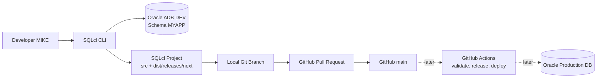
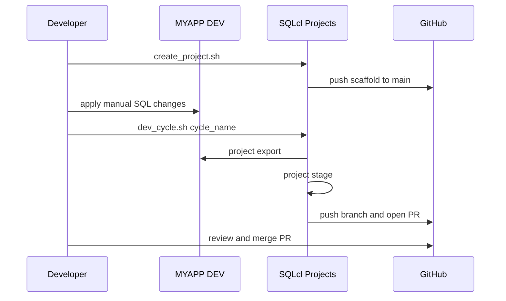

# Oracle DB SQLcl Project GitHub Actions Demo

Reusable Database CI/CD demo using Oracle SQLcl Projects.

This demo shows how a developer can capture Oracle Database model changes, version them in GitHub, generate SQLcl Projects changelogs, validate pull request branches, create release artifacts on demand, and deploy selected artifacts from GitHub Actions.

## Demo Story

The fictional application, `MYAPP`, manages the operations of a basketball team:

- teams, players, and coaches
- contracts and salaries
- games and player statistics
- sponsors, expenses, and revenue
- incremental data model changes across development cycles

The developer is `MIKE`, connected through proxy authentication to `MYAPP` with the saved local SQLcl connection `MIKE[MYAPP]`. The generated project keeps `sqlcl.connectionName` empty, so validation, release, and deployment jobs can use environment-specific connections later.

GitHub Actions connects directly to the validation database with the Autonomous
Database wallet and `connect -cloudconfig`. It does not create or reuse a saved
SQLcl connection name on the runner.

By default, the generated SQLcl Project is created under a developer-specific folder:

```text
/home/opc/mcp_demos/oracle-db-sqlcl-project-github-actions-demo/MIKE/projects/MyAppCICD
```

To reuse the demo with another developer, change `DEVELOPER_NAME` in `run/setup_env.sh` or export it before running the scripts.

## What This Demo Shows

- Initialize a SQLcl Project once.
- Export the real schema state into source files.
- Generate changelogs with `project stage`.
- Use Git branches and pull requests to review database changes.
- Accumulate staged changes in `main` without closing local releases.
- Validate branch changes with GitHub Actions.
- Close releases and generate artifacts on demand from `main`.
- List, preview, and deploy selected GitHub Release artifacts on demand.

## Architecture



## Development Flow



## Repository Layout

```text
.
|-- admin/                         # MYAPP and MIKE setup
|-- frontend/                      # static browser dashboard for the demo
|-- initial_schema_sql_scripts/    # reproducible initial schema
|-- ords/                          # read-only ORDS dashboard API
|-- reset/                         # reset back to the initial schema
|-- run/                           # demo runner scripts
|-- templates/                     # source templates copied into generated projects
|-- v1_sql_scripts/                # v1 development changes
|-- v2_sql_scripts/                # v2 development changes
`-- docs/                          # guides, speaker notes, and troubleshooting
```

## Main Scripts

| Script | Purpose |
|---|---|
| `run/create_project.sh` | Initializes the SQLcl Project, installs GitHub Actions templates, and synchronizes it with GitHub. Run once. |
| `run/configure_github_actions.sh` | Prompts for target database values and configures GitHub Actions secrets. |
| `run/dev_cycle.sh <cycle_name>` | Captures any development cycle: export, stage, commits, push, and PR. |
| `run/install_demo_dashboard_api.sh [dev\|prod\|both]` | Installs the read-only ORDS API used by the static demo dashboard. |
| `run/configure_demo_dashboard.sh` | Generates the local ignored frontend configuration file. |
| `run/configure_demo_dashboard_cors.sh [dev\|prod\|both]` | Updates ORDS CORS origins for the dashboard without reinstalling handlers. |
| `run/start_demo_dashboard.sh` | Configures the dashboard on first run and starts the local HTTP server. |
| `run/cleanup_demo.sh` | Cleans the local project, resets development, optionally drops all production schema objects, and optionally resets GitHub. |
| `admin/01_create_project_control.sql` | Creates the optional production `PROJECT_CONTROL` table used by the controlled deploy workflow. The workflow also creates it automatically if missing. |
| `reset/01_reset_to_initial_schema.sql` | Reverts v1/v2 changes and restores the initial schema. |
| `reset/02_drop_all_schema_objects.sql` | Drops production application and SQLcl Project/Liquibase objects, creates `PROJECT_CONTROL` if needed, keeps it, and truncates its contents. |

## Quick Start

```bash
cd /home/opc/mcp_demos/oracle-db-sqlcl-project-github-actions-demo/run

./create_project.sh
./dev_cycle.sh base_release
```

After merging the `base_release` PR, apply v1 manually in SQLcl:

```sql
CONNECT -name "MIKE[MYAPP]"
@/home/opc/mcp_demos/oracle-db-sqlcl-project-github-actions-demo/v1_sql_scripts/01_add_training_sessions_table.sql
@/home/opc/mcp_demos/oracle-db-sqlcl-project-github-actions-demo/v1_sql_scripts/02_add_player_social_media_handle.sql
@/home/opc/mcp_demos/oracle-db-sqlcl-project-github-actions-demo/v1_sql_scripts/03_rename_expenses_vendor_column.sql
```

Capture v1:

```bash
./dev_cycle.sh v1_changes
```

After merging the `v1_changes` PR, apply v2 manually:

```sql
CONNECT -name "MIKE[MYAPP]"
@/home/opc/mcp_demos/oracle-db-sqlcl-project-github-actions-demo/v2_sql_scripts/01_add_injury_reports_table.sql
@/home/opc/mcp_demos/oracle-db-sqlcl-project-github-actions-demo/v2_sql_scripts/02_add_game_revenue_columns.sql
```

Capture v2:

```bash
./dev_cycle.sh v2_changes
```

## Prerequisites

- SQLcl 26.1 or newer.
- Java 17 or 21.
- Git.
- GitHub CLI authenticated with `gh auth login`.
- Saved SQLcl connection named `MIKE[MYAPP]`.
- Autonomous Database wallet ZIP for the production target database.
- Schema `MYAPP` created and reset to the initial state.
- Target GitHub repository available for the generated SQLcl Project. The demo defaults to `vmendo/MyAppCICD`; override `GITHUB_USER` and `GITHUB_REPO` if needed.

## Detailed Guides

- [Demo Guide](docs/demo-guide.md)
- [Demo Dashboard](docs/demo-dashboard.md)
- [SQLcl Projects CI/CD Flow](docs/sqlcl-projects-cicd-flow.html)
- [Presenter Notes](docs/presenter-notes.md)
- [Commands Cheatsheet](docs/commands-cheatsheet.md)
- [Troubleshooting](docs/troubleshooting.md)
- [Phase 2: GitHub Actions](docs/next-phase-github-actions.md)

## Design Decisions

- `project release`, `project gen-artifact`, and `project deploy` are not run locally.
- `main` accumulates `src/` and `dist/releases/next/`.
- Each cycle opens a separate PR into `main`.
- This first version has one developer: `MIKE`.
- The project configuration keeps `sqlcl.connectionName` empty.
- GitHub Actions uses a direct wallet connection, not a saved SQLcl connection.
- GitHub Actions files are sourced from `templates/github-actions` and copied into the generated project.
- Objects matching `DBTOOLS$%` are excluded to avoid capturing internal tooling objects.

## Reset

To return to the initial state:

```bash
cd /home/opc/mcp_demos/oracle-db-sqlcl-project-github-actions-demo/run
./cleanup_demo.sh
```

The remote GitHub reset is optional and requires an explicit confirmation.
